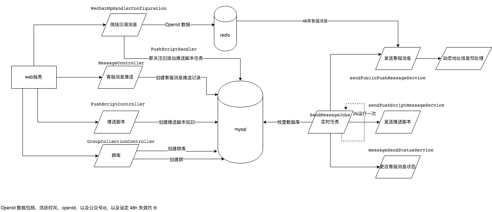

# 公众号管理平台开发记录

## 需求阶段

### 客户需求

客户给我们的需求主要分两方面，一方面是微信端，这个端主要是对接微信的各项功能，一个是平台使用端，主要是用来进行人员角色管理以及权限控制。

#### 微信端

1. 微信平台，能够绑定多个微信公众号。
2. 能够使用微信公众号批量发送消息。
3. 推送脚本（所谓的推送脚本是客户使用的名词，即用户关注后，在一定时间段之内，向用户推送消息）
4. 能够动态的加群，比如可以使用一个链接，这里的二维码针对每个人是不同的。但是要求同一个人在二维码未失效的情况下是相同的。

#### 平台使用端

1. 能够区分管理员和普通管理员
2. 管理员可以给普通管理员分配相关的管理公众号的权限。

## 技术选型

针对用户的需求，我们开始进行技术选型

### 微信开放平台 or 微信公众平台

1. 微信开放平台
   **微信开放平台**是指的可以替代微信公众号管理的第三方平台，是用来管理公众号的。

2. 微信公众平台

   **微信公众平台**是运营者通过公众号为微信用户提供资讯和服务的平台，而公众平台开发接口则是提供服务的基础，开发者在公众平台网站中创建公众号、获取接口权限后，可以通过阅读本接口文档来帮助开发。

为了识别用户，每个用户针对每个公众号会产生一个安全的OpenID，如果需要在多公众号、移动应用之间做用户共通，则需前往**微信开放平台**，将这些公众号和应用绑定到一个开放平台账号下，绑定后，一个用户虽然对多个公众号和应用有多个不同的OpenID，但他对所有这些同一开放平台账号下的公众号和应用，只有一个UnionID，可以在用户管理-获取用户基本信息（UnionID机制）文档了解详情。

看起来这两个平台都能完成需求，考虑到用户可能会做到用户共通，在调研了开放平台的基本功能之后，我们选择了微信开放平台进行开发。

### 开发语言

开发语言的选择其实我们并没有怎么纠结，因为我对 spring boot 当时还算比较熟（现在看来当时很肤浅），所以我们基本没怎么纠结就选择了 spring boot 作为框架。

另外，在开发之前，客户为我们推荐了 https://github.com/wechat-group/WxJava 这个项目，最后选择了项目中的 weixin-java-open 进行开发。整个库的质量还是不错的，开发起来遇到的问题也能很快通过度源码解决。

### 开发方式

客户的技术栈是 Vue 相关的，同时也要求我们的开发人员在前端使用 Vue 相关的技术栈进行开发以方便对接。我们采用了前后端分离的方法进行开发应用。

spring boot 用来提供 api server，然后前端可以独立进行开发。

*这里我们犯了一个错误，没有首先定义好 api ，这里浪费了一些时间，需要改进*

## 开始开发

### 如何进行前后端分离

1. 首先我们只是开发的时候前后端分离，这并不意味着我们部署的时候也是分别部署的（实际上我们也可以分开部署，但是没必要）。
2. 根据查看 spring boot 的相关文档，只要将 web 文件放在相关的 spring boot 的文件夹 `resources/static`下，spring boot 便会 serve 这些文件。
3. 前端使用 vue 开发之后，通过 build 会产生新的页面文件， single page application ，然后统统直接放在其下即可。

## Spring boot 开发纪要

### 整体后端架构图



### 初始化 spring boot 项目

1. 按照 spring boot 的 initializer 进行初始化，我使用了 `lombok`，`spring web`，` spring data jpa`, `spring data redis`, 另外，我们使用 的 mysql ，需要添加 `mysql` 的 `connector`，我们使用的 `build.gradle` 如下

   ```groovy
   buildscript {
       ext {
           springBootVersion = '2.0.4.RELEASE'
       }
       repositories {
           mavenCentral()
       }
       dependencies {
           classpath("org.springframework.boot:spring-boot-gradle-plugin:${springBootVersion}")
       }
   }
   
   apply plugin: 'java'
   apply plugin: 'eclipse'
   apply plugin: 'org.springframework.boot'
   apply plugin: 'io.spring.dependency-management'
   
   group = 'com.qingclass.java.wechat'
   version = '1.0.1-SNAPSHOT'
   sourceCompatibility = 1.8
   
   repositories {
       maven {
           url 'https://repo.spring.io/libs-release'
       }
       mavenCentral()
   }
   
   
   bootJar {
       mainClassName = 'com.qingclass.java.wechat.qingclass.QingclassApplication'
   }
   
   bootRun {
       systemProperties['spring.profiles.active']=project.gradle.startParameter.systemPropertiesArgs['spring.profiles.active']
   }
   
   compileJava.dependsOn(processResources)
   
   dependencies {
       compile('com.github.binarywang:weixin-java-open:3.1.0')
       compile('redis.clients:jedis:2.9.0')
       compile('org.springframework.boot:spring-boot-starter-actuator')
       compile('org.springframework.boot:spring-boot-starter-web')
       compile('org.springframework.boot:spring-boot-starter-security')
       compile('org.springframework.boot:spring-boot-starter-data-jpa')
       compile('org.springframework.boot:spring-boot-starter-webflux')
       compile('org.springframework.boot:spring-boot-starter-quartz')
       compile('org.springframework.data:spring-data-redis')
       compile('io.projectreactor.addons:reactor-extra')
       compile('mysql:mysql-connector-java')
       compile('io.jsonwebtoken:jjwt:0.7.0')
       runtime('org.springframework.boot:spring-boot-devtools')
       compileOnly('org.springframework.boot:spring-boot-configuration-processor')
       compileOnly('org.projectlombok:lombok')
       testCompile('org.springframework.boot:spring-boot-starter-test')
   }
   
   ```

2. 配置

   配置mysql 数据库,在本地开发环境，我们直接使用 `docker-compose` 来启动我们的后端开发环境。

   ```yaml
   version: '3'
   
   services: 
     qingclass-db:
       image: mariadb:10.3
       volumes:
         - ~/Dev/qingclass/db/var/lib/mysql:/var/lib/mysql
       environment:
         - MYSQL_ROOT_PASSWORD=root
         - MYSQL_DATABASE=qingclass
       ports:
         - 3306:3306
       command: --character-set-server=utf8mb4 --collation-server=utf8mb4_unicode_ci
   
   ```

   这样，所有的数据库数据会存在 `~/Dev/qingclass`下

   在 `application.properties` 中，写好配置项:

   ```properties
   logging.level.me.chanjar.weixin = DEBUG
   logging.level.org.springframework.web = DEBUG
   logging.level.com.qingclass.java.wechat.qingclass= DEBUG
   
   # The SQL dialect makes Hibernate generate better SQL for the chosen database
   spring.jpa.properties.hibernate.dialect = org.hibernate.dialect.MySQL5InnoDBDialect
   spring.jpa.hibernate.ddl-auto=update
   spring.datasource.url=jdbc:mysql://localhost:3306/qingclass?useUnicode=true&characterEncoding=utf8
   spring.datasource.username=root
   spring.datasource.password=root
   spring.datasource.hikari.connection-init-sql=SET NAMES utf8mb4
   
   # 调高连接池数量
   spring.datasource.hikari.maximum-pool-size=200
   # 链接超时时间调整为2min
   spring.datasource.hikari.connection-timeout=120000
   # 调低最大生命周期 15min
   spring.datasource.hikari.maxLifetime=900000
   
   #spring.jpa.generate-ddl=true
   spring.servlet.multipart.file-size-threshold=0
   spring.servlet.multipart.enabled=true
   spring.servlet.multipart.location=
   
   # redis config
   wechat.redis.max-total=200
   
   spring.servlet.multipart.max-file-size=5MB
   spring.servlet.multipart.max-request-size=5MB
   
   server.port = 8080
   ```

**注意: 上述配置有些隐私的配置项未完全列出**

### 文件存储的设计

文件存储我们的场景主要是用户的头像以及群库的二维码图片,在不使用第三方图片库的情况下，我们考虑了两种方案:

1. 自己配置 minio 来存储用户文件
2. 直接存储到数据库

经过一番调研发现我们的图片大小基本都在 2M 以内，我们选择了第二种方案，在 实体类中 ，使用了注解 `@Column(columnDefinition = "MEDIUMTEXT")`来存储 base64 格式的图片。


### 配置权限和用户系统

#### 权限模型设计

我们需要的角色有两种:

1. 超级管理员
   1. 用来管理管理员，操作公众号绑定/解绑操作
   2. 重置管理员密码
   3. 管理员的一切其他功能（查看以及修改公众号的推送信息）
2. 管理员
   1. 操作拥有权限的公众号信息
   2. 查看所有公众号的推送情况（但是不能修改）

*我们的做法是判断来源 token 的用户角色，然后查看角色的的权限来判断此请求能不能正常完成。*


**现在看来，我们至少能够改进的地方是**:

1. 将权限系统独立在单个模块内。
2. 使用更为灵活的权限模型。

#### 配置 oauth2 认证

我们使用的是 jwt 的认证方式，具体集成 spring boot 的方法见链接 [https://auth0.com/blog/implementing-jwt-authentication-on-spring-boot/](https://auth0.com/blog/implementing-jwt-authentication-on-spring-boot/) ，源码参考见: https://github.com/auth0-blog/spring-boot-jwts

### 数据库设计
1. 用户系统

   需要存储的数据有

   * 用户头像
   * 用户是否已启用
   * 用户是否第一次登录（第一次登陆需要修改密码）
   * 用户的昵称
   * 用户的密码
   * 用户的角色
   * 用户名

2. 微信开放平台

   1. 群库信息

      * 群库名称
      * 群库更新时间
      * 群库创建时间
      * 群库描述
      * 群库图片信息（base64）
      * 群库激活状态
      * 群库对应的公众号

   2. 记录每个 openId 所对应的群库

      * openid
      * 群库
      * 群
      * 创建时间

   3. 微信的公众号信息

       这个可以直接使用对应库中的 lib 定义的实体类，但是因为我们需要在数据库中存储，所以我们需要使用 工厂模式

### Reactor 设计

#### 获取 48 小时互动人数

1. 平台发送微信消息是利用的微信的客服消息接口，目前客服消息按照微信官方的说明是在 48 小时内跟公众号有交互信息的公众号，我们需要记录用户的 openId ，之后通过公众号发送出来。
2. 开始我们使用的 mySQL 来存储用户的公众号的 openId 信息，然后用户有新的互动，更新最后的互动时间，通过 SQL 查询语句查出在 48小时内更新的公众号信息，但是因为我们的客户大概有百万级别的用户互动，每次查询都需要遍历表，这样会导致数据库出现问题。
3. 后来，我们使用了 spring data redis，并设定了 过期时间（ttl），设定每个 openId 的过期时间为 48 小时，过期时间到了之后 redis 会自动清理 key，我们在查询的时候通过 redis 直接取出即可（对于大概 10万量级的互动，这中间会有大概 10s 左右的 block 时间，我们认为是可以接受的）

> 在我们部署到正式服务器的时候，我们发现连接青云的 redis 无法正常启动，经过排查之后发现青云出于安全原因默认关闭了CONFIG 功能，需要手动打开才能正确使用注解`@EnableRedisRepositories(enableKeyspaceEvents = EnableKeyspaceEvents.ON_STARTUP)`，参考链接见 https://docs.qingcloud.com/product/database_cache/redis-standalone/#%E5%8F%82%E6%95%B0%E4%BF%AE%E6%94%B9 ,具体内容见最下面。

4. 我们在每个客服消息发送完成之后会将每个openId发送发送数据库中，以便查看发送情况以及确定发送失败的原因。

#### 发送微信消息

1. 我们基本上不需要考虑发送到微信请求的 QPS 的问题，测试了一下基本上发送到微信的请求都能够正常执行，所以瓶颈在我们的服务器这边。

2. 我们使用了一个 Reator Processor 来控制请求的发出,核心代码及注释如下:

   ```java
   import lombok.extern.slf4j.Slf4j;
   import me.chanjar.weixin.common.error.WxErrorException;
   import org.apache.http.conn.ConnectionPoolTimeoutException;
   import org.hibernate.exception.JDBCConnectionException;
   import org.springframework.beans.factory.annotation.Autowired;
   import org.springframework.stereotype.Service;
   import reactor.core.publisher.EmitterProcessor;
   import reactor.core.publisher.FluxSink;
   import reactor.core.publisher.Mono;
   import reactor.core.scheduler.Scheduler;
   import reactor.core.scheduler.Schedulers;
   import reactor.retry.Retry;
   import reactor.retry.RetryContext;
   import reactor.retry.RetryExhaustedException;
   
   import javax.annotation.PostConstruct;
   import java.time.Duration;
   import java.util.function.Predicate;
   
   @Slf4j
   @Service
   public class SendJobEventProcessor {
       private final EmitterProcessor<PublicPush> processor;
       private final FluxSink<PublicPush> sink;
       private Scheduler scheduler = Schedulers.newSingle("send-job-processor-");
       private final PublicPushRepository publicPushRepository;
       private final WechatApiService wechatApiService;
       private final DynamicAddressSendService dynamicAddressSendService;
       private final SendStatusInfoRepository sendStatusInfoRepository;
       private final SendStatusRepository sendStatusRepository;
       private final QingClassConfig qingClassConfig;
   
       @Autowired
       public SendJobEventProcessor(
               PublicPushRepository publicPushRepository,
               WechatApiService wechatApiService,
               DynamicAddressSendService dynamicAddressSendService,
               SendStatusInfoRepository sendStatusInfoRepository,
               SendStatusRepository sendStatusRepository,
               QingClassConfig qingClassConfig) {
           this.publicPushRepository = publicPushRepository;
           this.wechatApiService = wechatApiService;
           this.dynamicAddressSendService = dynamicAddressSendService;
           this.sendStatusInfoRepository = sendStatusInfoRepository;
           this.sendStatusRepository = sendStatusRepository;
           this.qingClassConfig = qingClassConfig;
           this.processor = EmitterProcessor.create();
           this.sink = processor.sink();
       }
   
       //使用 PostContrust 注解会在程序constructor 执行后执行
       @PostConstruct
       private void processJobs() {
           processor.publishOn(scheduler)
                   .subscribe(this::createPublicPushJob);
       }
   
       //每一个到期的定时发送任务会通过暴露出来的此方法进入到发送流程中
       public void process(PublicPush publicPush) {
           sink.next(publicPush);
       }
   
       private void createPublicPushJob(PublicPush push) {
           int parallelism = qingClassConfig.getParallelism();
   
           new PublicPushFlux(push, wechatApiService, publicPushRepository, dynamicAddressSendService, sendStatusInfoRepository).flux()
               	//以单线程来更新发送状态，此状态存储在数据库中
                   .subscribeOn(Schedulers.newSingle("counting-"))
               	//parallelism 参数可以在 application.properties 配置以达到最优效果
                   .parallel(parallelism) 
               	//此方法定义了发送的线程数目
                   .runOn(Schedulers.newParallel("wechat-messasge-", parallelism))
                   .flatMap(
                           req -> Mono.fromCallable(() -> {
                               wechatApiService.sendWechatMessage(req);
                               return req;
                           })
                           .map(request -> {
                               sendStatusInfoRepository.findByOpenIdAndPublicPushId(
                                       request.getOpenId(),
                                       request.getPublicPushId()).ifPresent(
                                       sendStatusInfo ->
                                       {
                                           sendStatusInfo.setHasSucceed(true);
                                           sendStatusInfoRepository.save(sendStatusInfo);
                                       }
                               );
                               return request;
                           }) //在数据库中更新发送详情（如果进入此步骤，则说明发送已经成功)
                           .retryWhen(
                                   retryOnError(
                                           this::retryOnPoolConnectionTimeout,
                                           req,
                                           "connection pool timeout, retrying (retry #{})"
                                   )
                           ) //失败重试
                           .onErrorResume(ex -> {
                               final Throwable rootCause = (ex instanceof RetryExhaustedException)
                                       ? ex.getCause().getCause()
                                       : ex.getCause();
   
                               sendStatusInfoRepository.findByOpenIdAndPublicPushId(req.getOpenId(), req.getPublicPushId()).ifPresent(
                                       sendStatusInfo ->
                                       {
                                           sendStatusInfo.setHasSucceed(false);
                                           sendStatusInfo.setErrorMessage(rootCause.toString());
                                           sendStatusInfoRepository.save(sendStatusInfo);
                                       }
                               );
   
                               return Mono.empty();
                           })
                   )
                   .subscribe(new WechatSendSubscriber(
                           publicPushRepository,
                           push,
                           sendStatusRepository
                   ));
       }
   
   
       // 这里针对出现的错误来进行重试
       private Retry<PushMessageRequest> retryOnError(
               Predicate<? super RetryContext<PushMessageRequest>> predicate,
               PushMessageRequest req,
               String message
       ) {
           return Retry.onlyIf(predicate)
                   .withApplicationContext(req)
                   .exponentialBackoff(
                           Duration.ofSeconds(2),
                           Duration.ofSeconds(128)
                   )
                   .withBackoffScheduler(Schedulers.elastic())
                   .retryMax(10)
                   .doOnRetry(context -> log.warn(
                           message,
                           context.iteration(),
                           context.exception()
                   ))
                   ;
       }
   
   
       /**
        * 针对两种错误进行重试，一种是发送的apache连接池超时问题，一种是jdbc连接池超时问题
        */
       private boolean retryOnPoolConnectionTimeout(RetryContext<PushMessageRequest> context) {
           Throwable ex = context.exception();
   
           return (ex instanceof WxErrorException) && (ex.getCause() instanceof ConnectionPoolTimeoutException) || (ex instanceof JDBCConnectionException);
       }
   }
   
   ```

   

## 遇到的问题

### 微信显示图片会有防盗链提示

1. 反向代理 （放弃）
2. 去掉 http referrer (采用)
>带来问题，授权时候需要有 referrer，而且还要是指定的referrer （通过动态添加 referrer解决，这里的 状态问题花了一些时间）

### 发现系统有时会经常卡死

- 经查找，客户有一个大概 10000多人的记录，然后在系统查 10000多人记录的时候，就会卡死。

  - 使用 spring data jpa 分段
  - 取活跃人数采用直接返回个数，而不返回所有openId 的方法。

- 后来，我们使用了 spring data redis，在显示人数的时候使用 scard 来获取人数（这个人数不准确)，而发送的时候直接使用 findByPublicPushId 来获取，这样既保证了人数，又能返回完整的数据。

### 推送速度慢

* 因为之前的方案设计的通过一个通道发送到 一个队列中，这个队列的处理性能就很重要了，同时，这样设计存在一个问题，就是当队列中有一堆同时发送时，这里边会有一个顺序问题。
* 修改为每一个推送提供一个队列。

### 推送动态脚本，无法正常推送成功
* 发现在第二次推送动态脚本时便成功了，推送时人数会超出群组的限制人数。后来发现 Spring Data JPA 中的 findOne 方法经常会出现莫名其妙的问题。

* 解决方法改用 redis ，防止出现线程问题，动态脚本在推送之前便将48库中的openId 分配到对应的群组中，这样就可以直接发送了。

### 数据库连接池错误
* 经常会有大批量的推送报 get connection pool timeout，就是在发送请求时获取线程池超时。
* 添加重试机制，将会在失败后重试 10次，极大地提升了送达率。

## 反思

> 整个开发的过程中，发现了很多可以提高效率的问题。

1. 没有预先定义好 api ，导致前后端开发基本上处于一种各自开发自己的状态。
2. 没有尽快的使用 build 脚本，在使用 build 脚本之前，每次build 基本上都要花费半个小时的重复劳动时间，不仅劳神费力，而且很容易出现错误。
3. 用户权限模型管理不够灵活。
4. API 定义的不够 Restful ，当时我们看了 v2ex 的一篇文章，大家反映某些请求会被电信运营商随机的篡改。
5. Optional 的使用方法错误，现在看一堆 `if(optionalXXX.isEmpty())`方法非常的难受。